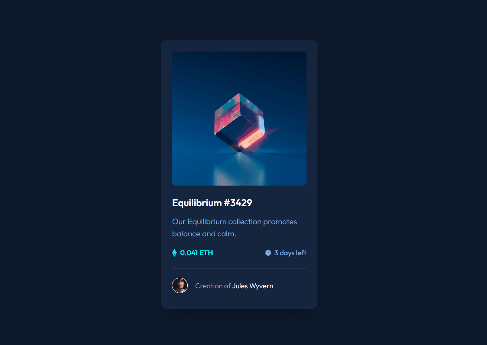

# Frontend Mentor - NFT preview card component solution
Esta é uma solução do [desafio - componente de cartão de visualização NFT no Frontend Mentor](https://www.frontendmentor.io/challenges/nft-preview-card-component-SbdUL_w0U). Os desafios do Frontend Mentor ajudam você a melhorar suas habilidades de codificação criando projetos realistas.

## Overview
### O desafio
Os usuários devem ser capazes de:

- Visualizar o layout ideal dependendo do tamanho da tela do dispositivo;
- Analisar os elementos do HTML para construir uma boa estrutura e criar   classes para que seja possível estilizar com pseudo-classes os links ativos.

### Screenshot

### Links
- Solução URL: [Front-end mentor](https://www.frontendmentor.io/solutions/nftpreviewcard-very-organized-with-clean-html-and-pseudoclasses-xte2WTll2G)
- Live Site URL: [Github pages](https://barbosagio.github.io/NFT-preview-card/)

## Meu processo
### Construção
- Análise do design;
- Criação da estrutura base do projeto (pastas, arquivos, etc...);
- Criação do HTML e sua estrutura;
- Criação dos arquivos CSS (style, variables, reset);
- Estilização dos elementos e pseudo-classes.

### O que eu aprendi
O maior desafio foi criar a animação para o overlay na imagem do nft-card, com a criação da pseudo-classe ::before e ::after. 
Aprendi sobre a junção do :hover com qualquer elemento desde que construido de forma inteligente.

## Programas utilizados
- HTML5
- CSS